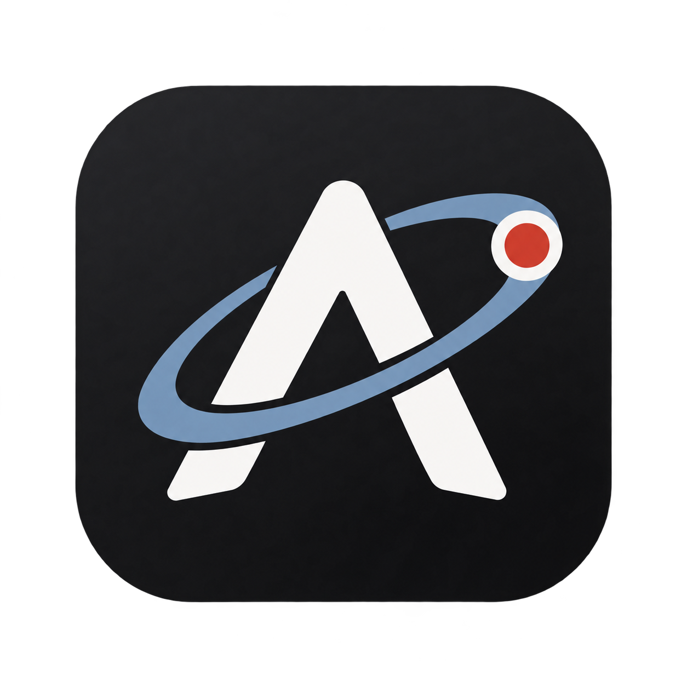

<p align="center">
  
</p>

<h1 align="center">Apollo</h1>

<p align="center">
  Lightweight recorder automation for Windows gaming sessions.
</p>

<p align="center">
  <a href="https://github.com/RetroMrii/Apollo/releases/latest">Download</a>
  ·
  <a href="docs/architecture.md">Architecture</a>
  ·
  <a href="LICENSE">MIT License</a>
</p>

Apollo watches for games you choose, starts your recording application when a gaming session begins, and closes it after the final game exits. It stays quietly available in the Windows notification area and is designed to consume negligible CPU while idle.

Apollo currently targets [Medal](https://medal.tv/) as its primary recorder, while keeping the recorder configuration generic.

## Features

- Automatically starts the configured recorder when a monitored game appears.
- Prevents duplicate recorder launches.
- Keeps the recorder running while any monitored game remains active.
- Waits five seconds before closing the recorder after the final game exits.
- Respects a manual recorder close for the remainder of the current gaming session.
- Supports multiple games, per-game enable controls, and a global monitoring switch.
- Adds games by browsing to an executable or selecting a running application.
- Extracts native executable icons where Windows permits access.
- Runs from the notification area with close-to-tray and double-click restore.
- Supports start minimized and optional per-user Windows startup.
- Stores configuration locally with atomic JSON writes.
- Requires no account, server, telemetry, or network connection.

## Download

Download the latest build from [GitHub Releases](https://github.com/RetroMrii/Apollo/releases/latest):

- **Installer** — recommended for most users. Installs per-user without administrator privileges and adds a Start menu shortcut.
- **Portable ZIP** — self-contained; extract it anywhere and run `Apollo.exe`.
- **SHA256SUMS.txt** — checksums for verifying release downloads.

Apollo release binaries are self-contained, so the .NET runtime does not need to be installed separately.

> [!NOTE]
> Release binaries are currently unsigned. Windows may display an unknown-publisher or SmartScreen warning.

## Getting started

1. Launch Apollo.
2. Select the recorder executable Apollo should manage.
3. Add one or more games by executable or from the running-application picker.
4. Enable monitoring.
5. Close the dashboard; Apollo will continue running in the notification area.

Right-click the tray icon to open Apollo, toggle monitoring, inspect recorder status, or exit the application.

## Session behavior

Apollo treats active games as a set rather than tracking only one game:

1. The first monitored game starts and Apollo launches the recorder if necessary.
2. Additional monitored games can start or stop without interrupting recording.
3. When the final game exits, Apollo waits approximately five seconds.
4. If no monitored game returns, Apollo terminates the configured recorder process.

If you manually close the recorder while a game is active, Apollo does not repeatedly restart it. Automatic launch becomes eligible again after every monitored game has stopped and a new session begins.

## Configuration and privacy

Settings are stored at:

```text
%LOCALAPPDATA%\Apollo\settings.json
```

Apollo performs local process-name checks at a conservative interval. It does not include analytics, telemetry, accounts, cloud synchronization, or background network traffic.

Windows startup uses the current-user Run key and does not require elevation:

```text
HKCU\Software\Microsoft\Windows\CurrentVersion\Run
```

## Requirements

### Published application

- Windows 11 x64

### Building from source

- Windows 11
- .NET 10 SDK
- PowerShell 7 recommended for packaging scripts
- Inno Setup 7 when building the installer

## Build and test

```powershell
git clone https://github.com/RetroMrii/Apollo.git
cd Apollo

dotnet restore Apollo.slnx
dotnet build Apollo.slnx --configuration Release --no-restore
dotnet test Apollo.slnx --configuration Release --no-build --no-restore
```

The solution contains deterministic core tests and focused Windows integration tests. The startup integration test uses a uniquely named temporary registry value and removes it during cleanup.

## Build release packages

```powershell
.\packaging\Create-Icon.ps1
.\packaging\Build-Packages.ps1
```

Outputs are written under `artifacts`:

```text
Apollo-<version>-win-x64-setup.exe
Apollo-<version>-win-x64-portable.zip
SHA256SUMS.txt
```

The packaging script always produces the self-contained portable archive. When the Inno Setup compiler is available, it also produces the non-admin per-user installer.

## Project structure

```text
src/Apollo.App/          WPF application, views, Windows adapters, and tray lifecycle
src/Apollo.Core/         Configuration, monitoring, and recorder session policy
tests/Apollo.App.Tests/  Focused Windows integration tests
tests/Apollo.Core.Tests/ Deterministic configuration and lifecycle tests
packaging/               Icon generation, publishing, and installer definitions
docs/                    Architecture and engineering decisions
```

Apollo intentionally avoids a third-party UI framework, dependency-injection container, database, web service, and third-party runtime packages. See [the architecture notes](docs/architecture.md) for detailed decisions and resource measurements.

## Current limitations

- Release packages currently target Windows x64 only.
- Recorder shutdown is forceful rather than application-specific or graceful.
- V1 identifies the recorder by its configured main process and does not model Medal helper processes.
- Apollo deliberately has no recorder ownership distinction: it may close a recorder that was already running before the gaming session.
- Published binaries are not yet code-signed.

## Contributing

Issues and focused pull requests are welcome. Please keep changes aligned with Apollo's priorities: reliability, low memory use, negligible idle CPU, and simple native Windows behavior.

Before submitting a change, run:

```powershell
dotnet build Apollo.slnx --configuration Release
dotnet test Apollo.slnx --configuration Release --no-build
```

## License

Apollo is available under the [MIT License](LICENSE).

---

Apollo is an independent project and is not affiliated with or endorsed by Medal.
